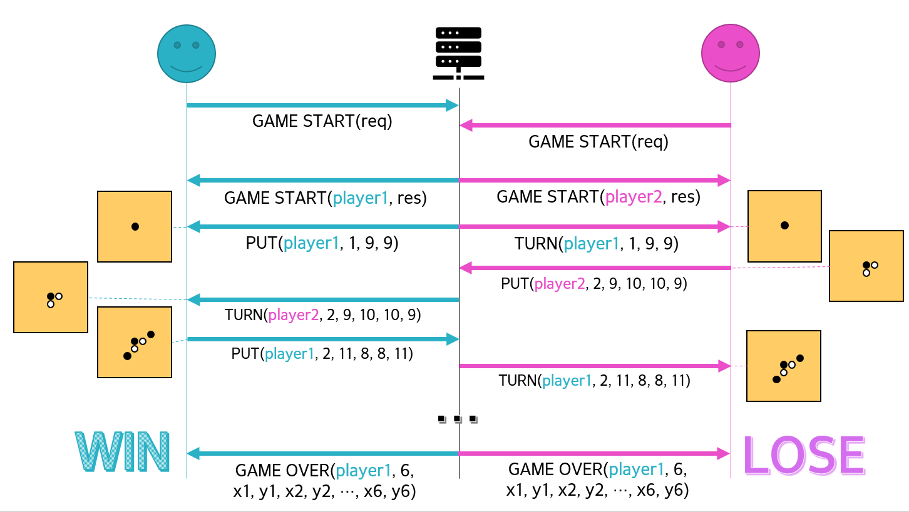
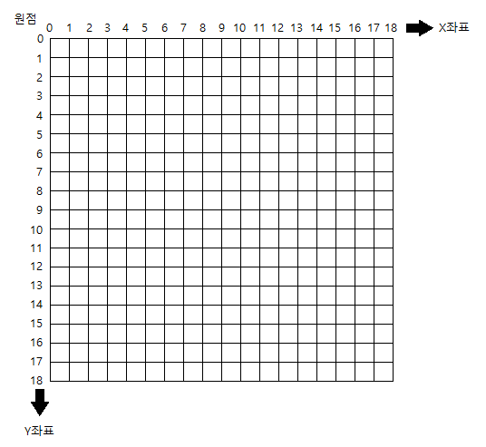

# bob9-connect6

BoB 9기 보안제품개발트랙 경연단계

육목 프로토콜 그리고 서버 / 클라이언트

## 프로그램 요구사항

+ server
  + Ubuntu 18.04 이상
+ client
  + Ubuntu 18.04 이상, Qt 5.15.2

## 게임 진행 흐름 그림

## 프로토콜 버전

0.1 (Beta)

## 프로토콜 기본 골격

**TCP/IP 기반 프로토콜** - TCP Data 필드에 육목 프로토콜이 포함된다.

포트 번호: **8089**

| Version (1B) | Type (1B) | PlayerNum (1B) | DataLength (1B) |
| :----------: | :-------: | :------------: | :-------------: |
|     Data     |           |                |                 |

+ Version (1B): 육목 프로토콜 버전
  + Beta=0, 정식=1, 2, 3, ...
+ Type (1B): 육목 프로토콜 종류
  + GAME_START, PUT, TURN 등의 순서로 번호가 부여됨
+ PlayerNum (1B): 플레이어 번호
  + 1, 2 중 하나
+ DataLength (1B): 육목 Data 필드의 길이 (바이트 수)
+ Data ((DataLength)B): 육목 Data 필드 (각 Type에 따라 달라짐)

## 육목 좌표계

## 육목 프로토콜 Type 목록

+ 0x00: GAME_START
+ 0x01: PUT
+ 0x02: TURN
+ 0x03: GAME_OVER
+ 0x04: ERROR
+ 0x05: TIMEOUT
+ 0x06: GAME_DISCARD

### GAME_START

GAME_START는 2가지 목적을 가진다.

+ 게임이 시작될 때 **클라이언트가 서버에게** 알리는 패킷 (플레이어 이름 포함)
+ 게임이 시작됐음을 **서버가 클라이언트에게** 알리는 패킷 (플레이어 번호 부여)

각 필드에 들어갈 값은 다음과 같다.

+ Type = 0x00 (GAME_START)
+ PlayerNum
  + request일 때, 0x00
  + response일 때, 서버에서 부여한 Player 번호
+ DataLength = NameLength + 2
+ Data
  + ReqResFlag (1B): Request이면 0x00, Response이면 0x01
  + NameLength (1B): Name 필드의 길이 (바이트)
  + Name ((NameLength)B): 플레이어의 이름. UTF-8 포맷으로 이루어짐.
    + request일 때, Name은 본인의 이름(닉네임)을 의미한다.
    + response일 때, Name은 상대방 플레이어의 이름(닉네임)을 의미한다.

### PUT

PUT은 2가지 목적을 가진다.

+ **클라이언트가** 돌을 뒀음을 **서버에게 알리는** 패킷
+ (게임 시작 때) **서버가 클라이언트에게** 자동으로 대신해서 돌을 뒀음을 알리는 패킷

각 필드에 들어갈 값은 다음과 같다.

+ Type = 0x01 (PUT)
+ PlayerNum = 돌을 둔 자신의 플레이어 번호
+ DataLength = 3 또는 5
+ Data
  + CoordNum (1B): 자신이 둔 돌의 개수 (=좌표 쌍의 개수)
  + X1, Y1, X2, Y2 (각각 1B): 자신이 돌을 둔 위치 좌표
    + 0\~18 사이의 범위를 가짐

초기 게임 시작의 돌의 개수 (CoordNum)는 1, 게임 진행 중에는 2

초기 게임 시작은 X1, Y1만 주어진다.

### TURN

TURN은 특정 클라이언트 차례가 됐을 경우, **서버가** 그 **클라이언트에게** 보내는 패킷이다.

각 필드에 들어갈 값은 다음과 같다.

+ Type = 0x02 (TURN)
+ PlayerNum = 돌을 뒀던 상대방의 플레이어 번호
+ DataLength = 3 또는 5
+ Data
  + CoordNum (1B): 상대방이 둔 돌의 개수 (=좌표 쌍의 개수)
  + X1, Y1, X2, Y2 (각각 1B): 상대방이 돌을 둔 위치 좌표
    + 0\~18 사이의 범위를 가짐

이 메시지를 받았다는 것은 자기 차례가 됐다는 의미이다.

초기 게임 시작의 돌의 개수 (CoordNum)는 1, 게임 진행 중에는 2

초기 게임 시작은 X1, Y1만 주어진다.

### GAME_OVER

GAME_OVER는 게임 오버될 경우 **서버가 두 클라이언트 모두에게** 보내는 패킷이다.

각 필드에 들어갈 값은 다음과 같다.

+ Type = 0x03 (GAME_OVER)
+ PlayerNum = 승리한 플레이어의 번호 (무승부 등 예외는 0x00)
+ DataLength = 2 또는 14
+ Data
  + Result (1B): 게임 결과
    + 플레이어가 중간에 나감 (GAME_DISCARD 패킷 받을 때): 0x00
    + 승부가 가려짐: 0x01
    + 무승부 (돌을 둘 곳이 없을 경우): 0x02
    + 연결 오류 등의 오류로 인한 게임 오버: 0x03
    + TIMEOUT으로 인한 게임 오버: 0x04
  + CoordNum (1B): 돌의 개수 (좌표 쌍의 개수)
    + 승부가 가려지면 6
    + 나머지는 0x00
  + X1, Y1, X2, Y2, ..., X6, Y6 (각각 1B, 총 12B)
    + 승리의 근거에 해당되는 여섯 개 돌의 좌표
    + 승부가 가려지지 않으면 없는 필드
    + 0\~18 사이의 범위를 가짐

### ERROR

ERROR는 패킷 처리에 에러가 발생할 경우 **서버가 클라이언트에게** 보내는 패킷이다.

각 필드에 들어갈 값은 다음과 같다.

+ Type = 0x04 (ERROR)
+ PlayerNum = 에러의 원인이 된 플레이어 번호.
  + 없거나 불분명하면 0x00
+ DataLength = 1
+ Data
  + ErrorType (1B): 에러 번호

에러 번호는 다음과 같다.

+ 0x00: 서버 내부 오류
+ 0x01: 프로토콜 규격에 맞지 않음
+ 0x02: 허용 좌표 범위를 넘음
+ 0x03: 게임이 시작되지 않은 상태 (PUT/TURN 등 전송 시)
+ 0x04: 정원 초과 (GAME_START 추가 요청 시)

### TIMEOUT

TIMEOUT은 특정 클라이언트가 TURN 상태이지만, 서버 내부 시간에서 주어진 시간동안 (30초) 서버가 PUT을 받지 못하면 **서버가 모든 클라이언트에게** 보내는 패킷이다.

각 필드에 들어갈 값은 다음과 같다.

+ Type = 0x05 (TIMEOUT)
+ PlayerNum = 시간을 초과한 (현재 TURN 상태인) 플레이어의 번호
+ DataLength = 0
+ Data: 없음

### GAME_DISCARD

GAME_DISCARD는 **클라이언트가** 게임 진행 중간에 포기할 경우 **서버에게** 보내는 패킷이다.

각 필드에 들어갈 값은 다음과 같다.

+ Type = 0x06 (GAME_DISCARD)
+ PlayerNum = 게임에서 나간 플레이어 번호 (서버가 종료할 경우 0x00)
+ DataLength = 0
+ Data: 없음

## 서버의 규칙

+ 시간 초과될 경우, TIMEOUT 패킷과 함께 GAME_OVER가 같이 보내진다.

